# Kiến trúc và luồng hệ thống

Tài liệu này mô tả **hệ thống hoạt động thế nào**: các tầng, luồng dữ liệu từ Wikidata/Wikipedia tới máy chủ, mô hình
RDFS/OWL, suy luận, kiểm tra chất lượng và các thành phần lúc chạy. Cách cài đặt, chạy và số liệu tổng quan nằm ở
[README.md](README.md).

> Sơ đồ viết bằng Mermaid, hiển thị trực tiếp trên GitHub. Trong VS Code cần extension
> *Markdown Preview Mermaid Support* để xem.

**Mục lục**

1. [Tổng quan kiến trúc](#1-tổng-quan-kiến-trúc)
2. [Luồng dữ liệu (pipeline)](#2-luồng-dữ-liệu-pipeline)
3. [Mô hình dữ liệu RDFS/OWL](#3-mô-hình-dữ-liệu-rdfsowl)
4. [Làm giàu kiểu DBpedia và trích infobox](#4-làm-giàu-kiểu-dbpedia-và-trích-infobox)
5. [Hậu xử lý: kiểm tra, suy luận, VoID](#5-hậu-xử-lý-kiểm-tra-suy-luận-void)
6. [Máy chủ: SPARQL endpoint, Linked Data và giao diện](#6-máy-chủ-sparql-endpoint-linked-data-và-giao-diện)
7. [Kiểm thử](#7-kiểm-thử)
8. [Các quyết định thiết kế](#8-các-quyết-định-thiết-kế)
9. [Thêm một lớp thực thể mới](#9-thêm-một-lớp-thực-thể-mới)

---

## 1. Tổng quan kiến trúc

Hệ thống có bốn tầng. Chỉ tầng thu thập gọi mạng, và mọi request đều đi qua cache SQLite. Dữ liệu thô được commit
vào `data/raw/`, nên các tầng sau dựng lại được toàn bộ dataset mà không cần Internet.

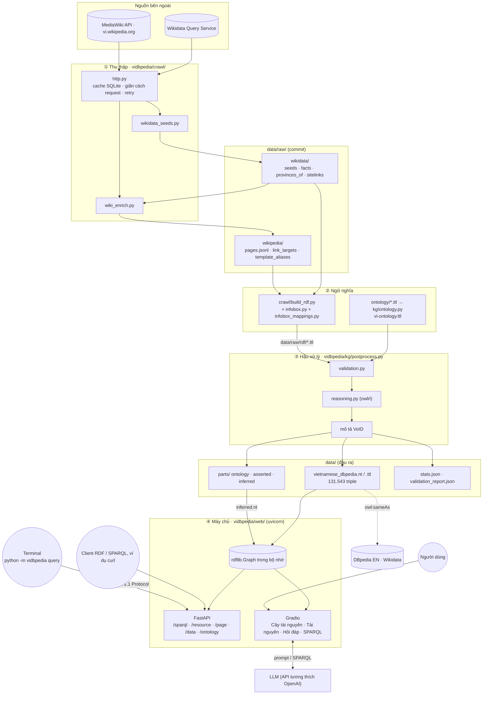

| Tầng | Module | Đầu vào | Đầu ra | Gọi mạng |
|---|---|---|---|---|
| ① Thu thập | `crawl/http.py`, `crawl/wikidata_seeds.py`, `crawl/wiki_enrich.py` | WDQS, MediaWiki API | `data/raw/wikidata/*.json`, `data/raw/wikipedia/*` | có (qua cache, `--offline` thì không) |
| ② Ngữ nghĩa | `kg/ontology.py`, `crawl/build_rdf.py`, `crawl/infobox.py`, `crawl/infobox_mappings.py`, `crawl/iri.py` | dữ liệu thô, các module ontology | `ontology/vi-ontology.ttl`, `data/raw/rdf/*.ttl` | không |
| ③ Hậu xử lý | `kg/postprocess.py`, `kg/validation.py`, `kg/reasoning.py` | ontology, RDF trung gian | `data/vietnamese_dbpedia.{nt,ttl}`, `data/parts/`, báo cáo | không |
| ④ Máy chủ | `web/app.py`, `web/ui.py`, `web/sparql.py`, `web/endpoint.py`, `web/resource_page.py`, `web/resource_tree.py`, `web/linked_data.py`, `web/kg_rag.py`; lệnh `query` (`kg/query.py`) | dataset cuối, `.env` | HTTP: giao diện, SPARQL endpoint, Linked Data | chỉ gọi LLM |

Đường dẫn module tính từ `vidbpedia/`. `vocab.py` khai báo namespace và `PREFIXES`, `common.py` khai báo đường dẫn
dữ liệu và logging, dùng chung cho mọi tầng. Mỗi bước chạy bằng `python -m vidbpedia <bước>` (`__main__.py`).

Các nguyên tắc chung:

- **Một hàm tạo IRI** (`crawl/iri.py: resource_iri`) cho mọi nơi, để một thực thể chỉ có một IRI.
- **Dựng graph bằng rdflib**, không ghép chuỗi Turtle bằng tay. Nhờ vậy không còn lỗi cú pháp hay escape.
- **Tách nguồn gốc triple**: ontology, khai báo và suy luận được ghi thành ba file riêng, rồi gộp thành bản đầy đủ.
- **Kiểm tra trước khi xuất**: với `python -m vidbpedia postprocess --strict`, chỉ cần một lỗi là pipeline dừng.

---

## 2. Luồng dữ liệu (pipeline)

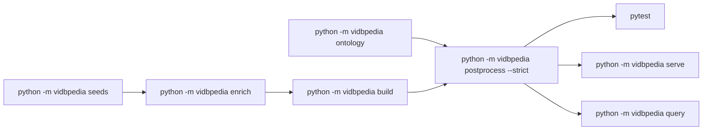

| Bước | Đầu vào | Xử lý | Đầu ra |
|---|---|---|---|
| `seeds` (`crawl/wikidata_seeds.py`) | `SEEDS`: một mẫu truy vấn cho mỗi lớp | Chọn thực thể có bài viwiki; enwiki là OPTIONAL. Loại trang danh sách (Q13406463), trang định hướng (Q4167410) và tiêu đề "Danh sách…". Một QID thuộc nhiều lớp thì giữ lớp đứng trước theo thứ tự ưu tiên trong `SEEDS`. Dữ kiện lấy theo khối `VALUES` ≤ 300 QID, gồm 3 nhóm: ngày tháng qua `psv:` kèm độ chính xác (`TIME_PROPS`), số lượng kèm thời điểm `P585` (`QUANTITY_PROPS`), quan hệ kèm qualifier `P580/P582/P1350/P1351` (`ITEM_PROPS`). Quy nơi sinh và địa điểm về tỉnh bằng `wdt:P131*`. Lấy sitelink của mọi QID được tham chiếu. | `seeds.json` (990), `facts.json`, `provinces_of.json`, `sitelinks.json` |
| `enrich` (`crawl/wiki_enrich.py`) | `seeds.json` | Gọi MediaWiki API theo lô 50 tiêu đề (wikitext: lô 10) với `formatversion=2` và `maxlag`. Lấy page ID, revision, ảnh, abstract, thể loại không ẩn, redirect, wikitext. Tìm infobox bằng `mwparserfromhell`. Giải đích các link trong infobox (đi theo redirect, đánh dấu trang định hướng). Lấy alias của template. | `pages.jsonl` (chỉ lưu tham số infobox và mục "Liên kết ngoài", không lưu cả wikitext), `link_targets.json` (2.588 tiêu đề, 71 trang định hướng), `template_aliases.json` |
| `ontology` (`kg/ontology.py`) | `ontology/0xx–4xx-*.ttl` | Ghép module theo thứ tự số, kiểm tra cú pháp bằng rdflib | `vi-ontology.ttl` (859 triple) |
| `build` (`crawl/build_rdf.py`) | dữ liệu thô của hai bước đầu | `Builder.core()` sinh các dataset cơ bản cho mọi thực thể (mục 4). `build_<Lớp>()` sinh thuộc tính riêng của từng lớp. `career()` dựng `CareerStation` từ chuỗi infobox, nếu thiếu thì dùng P54. `raw_infobox()` ghi `vip:` thô. | `data/raw/rdf/*.ttl` (11 file, 88.898 triple), `mapping_stats.json` |
| `postprocess` (`kg/postprocess.py`) | ontology + `data/raw/rdf/*.ttl` | Kiểm tra → suy luận → VoID → ghi file → đọc lại (mục 5) | `data/vietnamese_dbpedia.{nt,ttl}`, `data/parts/*`, `*_stats.json`, `validation_report.json` |

Tầng mạng (`crawl/http.py`):

- `Cache` ghi mỗi phản hồi vào bảng `kv(kind, key, value, fetched_at)` trong `data/cache/http.sqlite`. Cờ `--refresh` buộc tải lại; cờ `--offline` báo lỗi `OfflineMiss` nếu thiếu cache, thay vì gọi mạng.
- `_throttle` giãn cách request: WDQS 2 giây, Wikipedia 1 giây.
- `wiki_api` xử lý mã 429 và `maxlag`. `query_pages` gộp các trang trả về theo `continue` và ánh xạ lại tiêu đề đã chuẩn hoá hoặc đổi hướng.
- User-Agent lấy từ biến môi trường `VI_DBPEDIA_UA`.

### Một thực thể đi qua pipeline

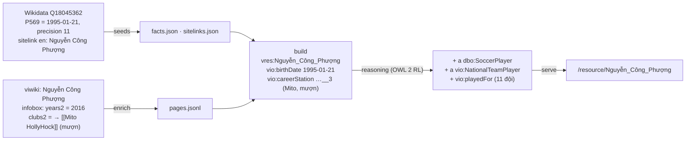

---

## 3. Mô hình dữ liệu RDFS/OWL

### 3.1 Namespace và quy ước IRI

| Prefix | Namespace | Dùng cho |
|---|---|---|
| `vio:` | `http://vi.dbpedia.org/ontology/` | lớp và thuộc tính của dự án (`ontology/`) |
| `vres:` | `http://vi.dbpedia.org/resource/` | tài nguyên (thực thể) |
| `vip:` | `http://vi.dbpedia.org/property/` | thuộc tính thô từ infobox, như `dbp:` của DBpedia |
| `vcat:` | `http://vi.dbpedia.org/resource/Thể_loại:` | thể loại Wikipedia (`skos:Concept`) |
| `dbo:` / `dbr:` | `http://dbpedia.org/ontology/` / `…/resource/` | DBpedia Ontology, tài nguyên DBpedia tiếng Anh |
| `wd:` | `http://www.wikidata.org/entity/` | thực thể Wikidata |

- **Tài nguyên:** `vres:` + tiêu đề viwiki đã chuẩn hoá (NFC, viết hoa ký tự đầu, khoảng trắng thành `_`). IRI giữ nguyên Unicode như các chapter DBpedia, chỉ mã hoá phần trăm các ký tự ``"%<>\^`{|}?#[]``. Ví dụ `vres:Nguyễn_Công_Phượng`.
- **Chặng thi đấu:** `vres:<Cầu_thủ>__<n>`, đánh số theo thứ tự đội trẻ → CLB → đội tuyển. Ví dụ `vres:Nguyễn_Công_Phượng__3`.
- **Trang đổi hướng:** là tài nguyên riêng, có `dbo:wikiPageRedirects` trỏ về trang chính. Tên khác đồng thời được ghi thành `skos:altLabel` của trang chính.
- **Liên kết ngoài:** `owl:sameAs dbr:<tiêu đề enwiki>` (cũng giữ Unicode) và `owl:sameAs wd:Q…`.

### 3.2 Đồ thị lớp

Mỗi lớp `vio:` là `rdfs:subClassOf` của một lớp DBpedia. Thuộc tính đối tượng nối các cây lớp theo đúng chuỗi của
câu hỏi nhiều bước: cầu thủ → chặng thi đấu → đội → sân nhà → tỉnh.

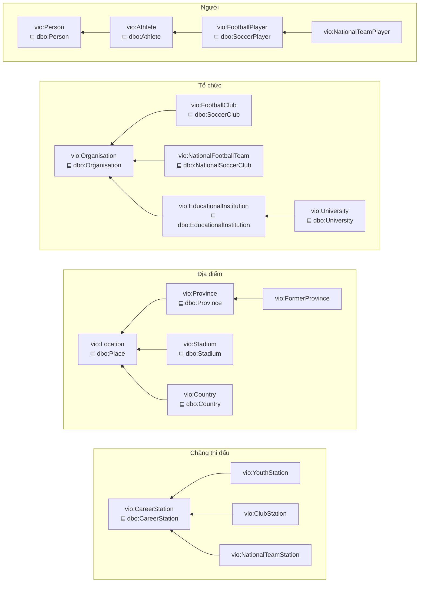

*Mũi tên là `rdfs:subClassOf`, trỏ từ lớp con sang lớp cha; dòng "⊑ dbo:…" là lớp DBpedia mà lớp `vio:` kế thừa.*

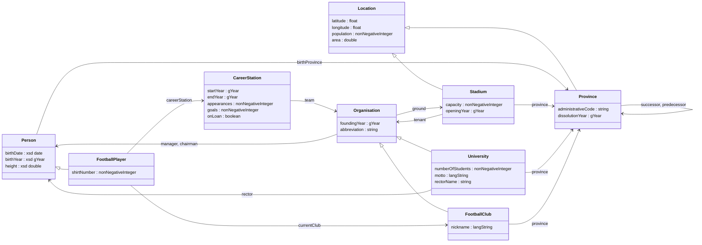

*Mô hình rút gọn, mọi lớp đều thuộc `vio:`. Các lớp trung gian (`Athlete`, `EducationalInstitution`) và các lớp con
của `CareerStation` được lược bớt. `vio:country` (mọi thực thể → `vres:Việt_Nam`) cũng không vẽ. Bảng đầy đủ ở mục 3.3.*

### 3.3 Thuộc tính

Có 54 thuộc tính `vio:`, gồm 26 object property và 28 datatype property. Mỗi thuộc tính khai báo loại (Object hay
Datatype), domain, range, có nhãn @vi và @en, và đều là `rdfs:subPropertyOf` một thuộc tính `dbo:` cùng loại nếu
DBpedia có thuộc tính tương ứng. Ký hiệu F là `owl:FunctionalProperty`.

<details>
<summary>Bảng đầy đủ 54 thuộc tính</summary>

| Thuộc tính | Loại | Domain | Range | ⊑ / tiên đề |
|---|---|---|---|---|
| `vio:abbreviation` | D | Organisation | xsd:string | dbo:abbreviation |
| `vio:academicStaffSize` | D, F | EducationalInstitution | xsd:nonNegativeInteger | dbo:facultySize |
| `vio:administrativeCode` | D, F | Province | xsd:string | |
| `vio:affiliation` | O | Organisation | | dbo:affiliation |
| `vio:appearances` | D, F | CareerStation | xsd:nonNegativeInteger | dbo:numberOfMatches |
| `vio:area` | D, F | Location | xsd:double | |
| `vio:birthDate` | D, F | Person | xsd:date | dbo:birthDate, schema:birthDate |
| `vio:birthPlace` | O | Person | Location | dbo:birthPlace, schema:birthPlace |
| `vio:birthProvince` | O | Person | Province | vio:birthPlace |
| `vio:birthYear` | D, F | Person | xsd:gYear | dbo:birthYear |
| `vio:capacity` | D, F | Stadium | xsd:nonNegativeInteger | dbo:seatingCapacity |
| `vio:capital` | O | Location | | dbo:capital |
| `vio:careerStation` | O | FootballPlayer | CareerStation | dbo:careerStation |
| `vio:chairman` | O | Organisation | Person | dbo:chairman |
| `vio:country` | O | | Country | dbo:country |
| `vio:currentClub` | O | FootballPlayer | FootballClub | dbo:team |
| `vio:deathDate` | D, F | Person | xsd:date | dbo:deathDate, schema:deathDate |
| `vio:dissolutionYear` | D, F | | xsd:gYear | dbo:dissolutionYear |
| `vio:endYear` | D, F | CareerStation | xsd:gYear | |
| `vio:foundingDate` | D, F | Organisation | xsd:date | dbo:foundingDate |
| `vio:foundingYear` | D, F | Organisation | xsd:gYear | dbo:foundingYear |
| `vio:goals` | D, F | CareerStation | xsd:nonNegativeInteger | dbo:numberOfGoals |
| `vio:ground` | O | Organisation | Stadium | dbo:ground |
| `vio:hasPart` | O | | | owl:inverseOf vio:isPartOf |
| `vio:hasPlayer` | O | | | owl:inverseOf vio:playedFor |
| `vio:height` | D, F | Person | xsd:double | dbo:height |
| `vio:isPartOf` | O | Location | Location | dbo:isPartOf |
| `vio:latitude` | D, F | | xsd:float | wgs84:lat |
| `vio:league` | O | FootballClub | | dbo:league |
| `vio:locatedIn` | O | | Location | dbo:location, schema:location |
| `vio:longitude` | D, F | | xsd:float | wgs84:long |
| `vio:manager` | O | Organisation | Person | dbo:manager |
| `vio:managerName` | D | Organisation | xsd:string | |
| `vio:motto` | D | EducationalInstitution | rdf:langString | dbo:motto |
| `vio:nickname` | D | | rdf:langString | |
| `vio:numberOfStudents` | D, F | EducationalInstitution | xsd:nonNegativeInteger | dbo:numberOfStudents |
| `vio:onLoan` | D, F | CareerStation | xsd:boolean | |
| `vio:openingYear` | D, F | Stadium | xsd:gYear | dbo:openingYear |
| `vio:operator` | O | | | dbo:operator |
| `vio:owner` | O | | | dbo:owner |
| `vio:playedFor` | O | | | owl:propertyChainAxiom (careerStation team) |
| `vio:population` | D, F | Location | xsd:nonNegativeInteger | dbo:populationTotal |
| `vio:populationYear` | D, F | Location | xsd:gYear | |
| `vio:position` | O | FootballPlayer | | dbo:position |
| `vio:predecessor` | O | | | dbo:predecessor, owl:inverseOf vio:successor |
| `vio:province` | O | | Province | vio:locatedIn |
| `vio:rector` | O | EducationalInstitution | Person | dbo:rector |
| `vio:rectorName` | D | EducationalInstitution | xsd:string | |
| `vio:region` | O | | | dbo:region |
| `vio:shirtNumber` | D | FootballPlayer | xsd:nonNegativeInteger | dbo:number |
| `vio:startYear` | D, F | CareerStation | xsd:gYear | |
| `vio:successor` | O | | | dbo:successor |
| `vio:team` | O | CareerStation | | dbo:team |
| `vio:tenant` | O | Stadium | | dbo:tenant |

</details>

Một số thuộc tính cố ý không khai báo domain:

- `latitude`, `longitude`, `country`, `province`, `locatedIn`: CLB và trường đại học cũng có các thuộc tính này. Nếu đặt domain là `Location`, reasoner sẽ suy ra CLB là địa điểm, mâu thuẫn với `AllDisjointClasses`.
- `ground`, `manager`, `chairman` có domain `Organisation`, không phải `FootballClub`, vì đội tuyển quốc gia cũng có sân nhà và huấn luyện viên.

### 3.4 Tiên đề OWL

| Loại | Tiên đề | Tác dụng khi suy luận |
|---|---|---|
| Property chain | `vio:playedFor ≡ vio:careerStation ∘ vio:team` | cầu thủ → các đội từng chơi, không cần đi qua chặng |
| Inverse | `vio:hasPlayer owl:inverseOf vio:playedFor`; `vio:hasPart` ↔ `vio:isPartOf`; `vio:predecessor` ↔ `vio:successor` | truy vấn được theo cả hai chiều |
| Restriction (∃) | `FootballPlayer ⊓ ∃careerStation.NationalTeamStation ⊑ NationalTeamPlayer` (dạng giao như lời giải anti-pattern Exclusivity, slide 07; OWL 2 RL chỉ cho dạng này ở vế trái) | 486 cầu thủ được xếp vào lớp đội tuyển |
| Restriction (∀) | `ClubStation ⊑ ∀team.FootballClub`; `YouthStation ⊑ ∀team.FootballClub`; `NationalTeamStation ⊑ ∀team.NationalFootballTeam` | đội nước ngoài trong chặng thi đấu có lớp, dù không phải seed |
| Disjoint | {Person, Organisation, Location, CareerStation}; {Province, Stadium, Country}; {FootballClub, EducationalInstitution, NationalFootballTeam}; {YouthStation, ClubStation, NationalTeamStation} | reasoner báo lỗi khi mô hình suy ra điều vô lý (mục 5.2) |
| Functional | 22 datatype property (ngày sinh, chiều cao, sức chứa…) | không đưa vào reasoner; `validation.check_functional` kiểm tra thay |

### 3.5 Module ontology

| Module | Nội dung chính |
|---|---|
| `000-prefixes` | prefix dùng chung |
| `050-dbo-alignment` | 24 lớp và 44 thuộc tính DBpedia mà `vio:` ánh xạ tới, đối chiếu trên DBpedia: cây lớp, loại (Object/Datatype), nhãn @en của DBpedia và nhãn @vi do nhóm dịch (ví dụ `dbo:Animal` "Động vật"), `rdfs:isDefinedBy dbo:`. Thêm 6 thuộc tính schema.org / WGS84 là thuộc tính cha của `vio:` (khai báo loại để không có thuật ngữ nào chưa có kiểu). Không nhập domain/range của `dbo:` để tránh suy luận ngoài ý muốn. |
| `100-core-classes` | header `owl:Ontology` (phiên bản 2.0, CC BY-SA 4.0), 18 lớp, 4 tiên đề `owl:AllDisjointClasses` |
| `200-person`, `220-athlete` | `birthDate`/`birthYear`, `birthProvince ⊑ birthPlace`; `careerStation`, `team`, `startYear`, `appearances`, `goals`, `onLoan`; property chain, inverse, restriction |
| `300-location`, `310-stadium` | `province ⊑ locatedIn`, `population`, `area`, `dissolutionYear`, `successor`/`predecessor`, `capital`, `region`; `capacity`, `openingYear`, `owner`, `operator`, `tenant` |
| `400`–`420` | `founding*`, `abbreviation`, `affiliation`; `motto` (`rdf:langString`), `numberOfStudents`, `rector`/`rectorName`; `ground`, `league`, `manager`, `chairman`, `nickname` |

`vio:FormerProvince` gồm các tỉnh đã giải thể hoặc sáp nhập, kể cả đợt sắp xếp năm 2025. Một tỉnh được coi là tỉnh cũ
nếu Wikidata ghi `P576` (ngày giải thể), hoặc nếu không còn `P31` hiện hành là tỉnh (Q2824648) hay thành phố trực
thuộc trung ương (Q1381899). Nhờ vậy câu hỏi "còn bao nhiêu tỉnh" trả đúng 34.

### 3.6 Ví dụ đồ thị một thực thể

Nét liền là triple khai báo, nét đứt là triple suy luận, nét đậm là liên kết LOD ra ngoài.

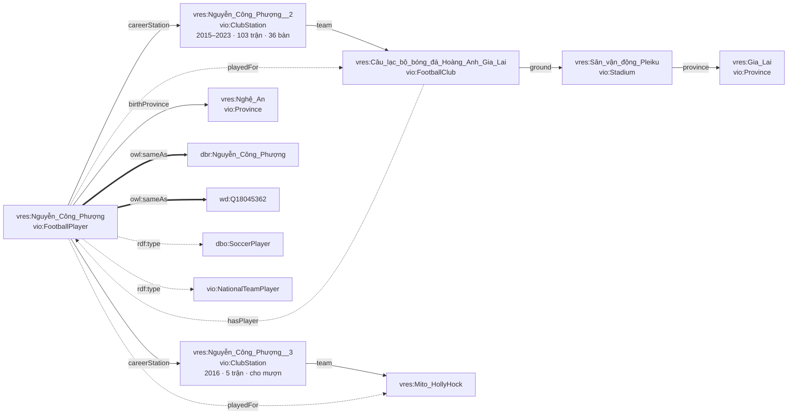

---

## 4. Làm giàu kiểu DBpedia và trích infobox

### 4.1 Dataset cơ bản cho mọi thực thể (`Builder.core`)

| DBpedia dataset | Thuộc tính |
|---|---|
| Labels, short/long abstracts | `rdfs:label` @vi @en, `rdfs:comment` (≤ 400 ký tự), `dbo:abstract` |
| Page IDs, revisions, provenance | `dbo:wikiPageID`, `dbo:wikiPageRevisionID`, `dbo:wikiPageLength`, `prov:wasDerivedFrom <…?oldid=REV>`, `foaf:isPrimaryTopicOf` (và `foaf:primaryTopic` ngược lại) |
| Images | `dbo:thumbnail`, `foaf:depiction` (bỏ query `?utm_source=…` mà API gắn thêm) |
| Article categories | `dct:subject vcat:…`; mỗi thể loại là `skos:Concept` có `skos:prefLabel` |
| Redirects | tài nguyên `dbo:wikiPageRedirects` → thực thể, kèm `skos:altLabel` để tìm theo tên khác |
| External links, homepages | `dbo:wikiPageExternalLink` (chỉ lấy từ mục "Liên kết ngoài"), `foaf:homepage` |
| Geo coordinates | `vio:latitude`/`vio:longitude` (⊑ `wgs84:`), `georss:point`; ưu tiên toạ độ P625 |
| Interlanguage links | `owl:sameAs dbr:…` lấy từ sitelink enwiki của chính item Wikidata, `owl:sameAs wd:…`; `validation.check_sameas` báo lỗi nếu đích là trang danh sách hoặc định hướng |

### 4.2 Trích infobox

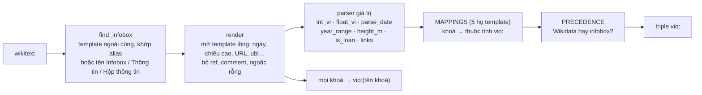

| Họ template | Tìm thấy infobox | Khoá được ánh xạ sang `vio:` |
|---|---|---|
| Cầu thủ (`Thông tin tiểu sử bóng đá`) | 602 / 611 | ngày sinh, nơi sinh, chiều cao, vị trí, CLB hiện tại, số áo; chuỗi `years{n}/clubs{n}/caps{n}/goals{n}` (cùng `youth*` và `national*`) → `CareerStation` |
| CLB (`Hộp thông tin câu lạc bộ bóng đá`) | 59 / 61 | thành lập, sân, chủ tịch, huấn luyện viên, giải đấu, biệt danh, website |
| Sân vận động | 29 / 29 | địa điểm, khánh thành, sức chứa, chủ sở hữu, đơn vị quản lý, đội thuê sân |
| Đại học (`Thông tin trường học`) | 159 / 168 | tên tiếng Anh, viết tắt, khẩu hiệu, thành lập, hiệu trưởng, số sinh viên (cộng các bậc nếu thiếu tổng), giảng viên, thành phố, thành viên của |
| Tỉnh (`Thông tin đơn vị hành chính Việt Nam`) | 101 / 110 | diện tích, dân số, năm thống kê, vùng, tỉnh lỵ, mã hành chính |

- **Số và năm:** parser hiểu số kiểu Việt (`16.361,2`), khoảng năm (`2015–`) và dấu cho mượn (`→`, `(mượn)`).
- **Chiều cao:** chỉ nhận giá trị trong khoảng 1,4–2,2 m.
- **Nguồn ưu tiên:** khi Wikidata và infobox cùng có giá trị, `PRECEDENCE` quyết định.
  - Lấy từ Wikidata: ngày, chiều cao, dân số, diện tích, sức chứa, năm khánh thành, homepage, viết tắt.
  - Lấy từ infobox: số áo, số sinh viên, số giảng viên, khẩu hiệu, mã hành chính.
  - Thuộc tính đối tượng gộp giá trị của cả hai nguồn.
- **Lọc đích liên kết theo lớp:**
  - `team` của chặng thi đấu không được trỏ tới tỉnh, sân hay trường đại học.
  - `ground` phải trỏ tới sân.
  - `tenant` chỉ giữ những đội có trong dataset.
- **Nhãn của chặng thi đấu:** lấy theo tiêu đề trang của đội, ví dụ "Nguyễn Công Phượng – Mito HollyHock (2016–2016)".
- **Infobox thô:** mọi khoá, kể cả khoá chưa ánh xạ, vẫn được ghi thành `vip:<khoá>` (26.001 triple, 698 thuộc tính). `mapping_stats.json` thống kê khoá nào đã ánh xạ (✓), khoá nào chưa (?) theo từng họ template.

---

## 5. Hậu xử lý: kiểm tra, suy luận, VoID

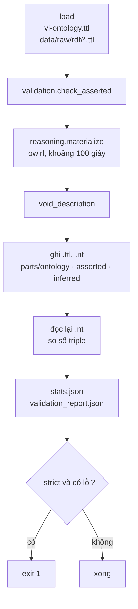

### 5.1 Kiểm tra chất lượng (`kg/validation.py`)

Mỗi hàm `check_*` trả về danh sách `Issue(severity, check, subject, detail)`. `kg/postprocess.py` và `tests/test_quality.py`
dùng chung các hàm này.

| Hàm | Kiểm tra |
|---|---|
| `check_tbox` | `subPropertyOf` không nối hai thuộc tính khác loại; mọi lớp `vio:` có tổ tiên `dbo:`; mọi lớp và thuộc tính dùng trong tiên đề đều được khai báo kiểu; mọi thuật ngữ khai báo (cả `dbo:`, `schema:`, `wgs84:`) có nhãn vi và en và `rdfs:isDefinedBy` về từ vựng của nó; lớp `vio:` viết hoa chữ đầu, thuộc tính `vio:` viết thường chữ đầu |
| `check_property_kinds` | ObjectProperty trỏ tới IRI, DatatypeProperty có giá trị là literal |
| `check_datatype_ranges` | literal đúng `rdfs:range` (kể cả `rdf:langString`) và không ill-typed |
| `check_required` | mỗi thực thể chính có đúng một lớp chính, nhãn @vi, `foaf:isPrimaryTopicOf`, `owl:sameAs wd:` (thiếu page ID chỉ là cảnh báo) |
| `check_functional` | thuộc tính functional có tối đa một giá trị |
| `check_object_ranges` | giả định đóng: nếu đích là thực thể đã có lớp thì lớp đó phải hợp với range |
| `check_sameas` | không trỏ tới trang danh sách hay định hướng; không có hai `vres:` cùng trỏ một đích |
| `check_plausibility` | toạ độ trong Việt Nam, năm sinh 1900–2015, sức chứa, dân số, chiều cao hợp lý (cảnh báo) |
| *(trong `kg/postprocess.py`)* | lỗi `err:` của reasoner (vi phạm disjoint); ghi rồi đọc lại phải ra đủ số triple |

Kết quả lần dựng gần nhất: 0 lỗi, 0 cảnh báo.

### 5.2 Suy luận (`kg/reasoning.py`)

`materialize(ontology, asserted, semantics)` chạy `owlrl.DeductiveClosure(OWLRL_Semantics)` theo các bước:

1. **TBox:** dùng ontology nhưng bỏ `FunctionalProperty`, `InverseFunctionalProperty`, cardinality và `owl:sameAs`.
   Lý do: OWL 2 RL sinh `x owl:sameAs x` cho mọi nút và có thể gộp các thực thể lại với nhau.
2. **ABox rút gọn ("phần khung"):** chỉ đưa vào `rdf:type` và các triple `vio:` của tài nguyên `vres:`. Abstract, ảnh,
   `vip:`… không ảnh hưởng tới kết quả suy luận, nên bỏ ra để reasoner chạy nhanh hơn.
3. **Lọc kết quả:** chỉ giữ triple mới có lớp `vio:`/`dbo:` hoặc thuộc tính `vio:`/`dbo:`/`wgs84:`, không giữ `owl:sameAs`.
   Kết quả ghi riêng ra `data/parts/inferred.nt`.
4. **Báo lỗi:** các vi phạm (`ErrorMessage` của owlrl) được đưa vào báo cáo kiểm tra.

Cờ `--reasoner rdfs` dùng RDFS semantics (nhanh hơn, không có chain/inverse). `--no-reason` bỏ hẳn bước này.

| Truy vấn | Chỉ dữ liệu khai báo | Sau suy luận | Suy ra nhờ |
|---|---|---|---|
| `?x a dbo:Person` | 0 | 659 | `subClassOf`; 48 HLV, chủ tịch, hiệu trưởng nhờ `rdfs:range` |
| `?x a dbo:SoccerPlayer` | 0 | 611 | `vio:FootballPlayer ⊑ dbo:SoccerPlayer` |
| `?x a dbo:Organisation` / `dbo:Place` | 0 / 0 | 410 / 370 | `subClassOf` |
| `?x a vio:NationalTeamPlayer` | 0 | 486 | restriction `FootballPlayer ⊓ ∃careerStation.NationalTeamStation` |
| `?x vio:playedFor ?club` | 0 | 2.772 | property chain `careerStation ∘ team` |
| `?club vio:hasPlayer ?x` | 0 | 2.772 | `owl:inverseOf playedFor` |
| `?x dbo:team ?t` | 0 | 3.699 | `subPropertyOf` |

Suy luận đã giúp phát hiện hai lỗi mô hình hoá:

- **Đội tuyển bị suy ra là CLB.** Reasoner báo vi phạm `owl:AllDisjointClasses`. Nguyên nhân là `vio:ground`,
  `manager`, `chairman` có domain `FootballClub`, nên đội tuyển quốc gia có sân nhà bị suy ra là CLB. Đã sửa bằng
  cách đổi domain thành `vio:Organisation`.
- **Sai sân nhà.** Câu hỏi "CLB nào có sân nhà ở Hà Nội?" trả cả SHB Đà Nẵng và Khatoco Khánh Hoà. Nguyên nhân là
  `vio:tenant` từng được khai báo `owl:inverseOf vio:ground`, trong khi ô "bên thuê" của Hàng Đẫy liệt kê mọi đội
  từng dùng sân, kể cả giải ASEAN 2024. Đã bỏ tiên đề nghịch đảo này (DBpedia cũng tách `dbo:tenant` và
  `dbo:ground`) và chỉ giữ những đội có trong dataset.

### 5.3 Mô tả dataset (VoID) và đầu ra

`void_description()` mô tả `<http://vi.dbpedia.org/void/Dataset>` gồm:

- **Thông tin chung:** tiêu đề, mô tả, `dct:license` (CC BY-SA 4.0), `dct:source` (viwiki, Wikidata), `dct:created`.
- **Từ vựng và vị trí tải:** `void:uriSpace`, `void:vocabulary` (`vio:`, `dbo:`), `void:dataDump`.
- **Subset:** 3 subset theo nguồn gốc (ontology, khai báo, suy luận), mỗi subset có số triple và đường dẫn tải riêng.
- **Phân lớp:** `void:classPartition` theo 7 lớp chính.
- **Linkset:** 2 `void:Linkset` tới DBpedia và Wikidata (`owl:sameAs`, kèm số liên kết).

| File | Nội dung |
|---|---|
| `data/vietnamese_dbpedia.nt` / `.ttl` | bản đầy đủ = ontology + khai báo + suy luận + VoID (máy chủ nạp file `.nt` vì parse nhanh hơn) |
| `data/parts/ontology.ttl`, `asserted.nt`, `inferred.nt` | tách theo nguồn gốc; máy chủ dùng `inferred.nt` để đánh dấu triple "suy luận" |
| `data/vietnamese_dbpedia_stats.json` | số triple, số thực thể theo lớp, số liên kết, thời gian suy luận, số lỗi |
| `data/validation_report.json` | toàn bộ `Issue` |
| `data/vietnamese_dbpedia.rdf` | chỉ có khi chạy với `--rdfxml` |

---

## 6. Máy chủ: SPARQL endpoint, Linked Data và giao diện

### 6.1 Thành phần lúc chạy

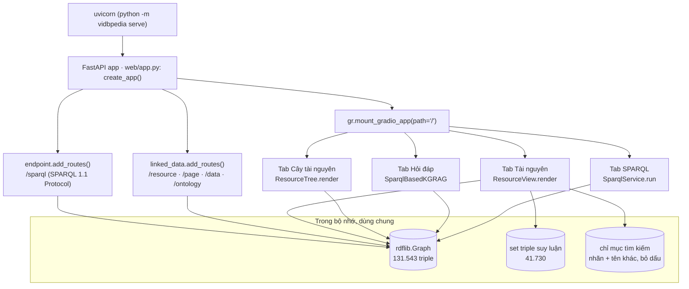

Thứ tự khởi động (`create_app`), tổng cộng khoảng 7 giây trên máy thử:

1. `SparqlService` (`web/sparql.py`) nạp `data/vietnamese_dbpedia.nt` (khoảng 4 giây) và đọc số liệu từ `*_stats.json`.
2. `ResourceView.from_files` nạp `data/parts/inferred.nt` và dựng chỉ mục tìm kiếm (2.839 tên).
3. `ResourceTree` tính sẵn cây lớp và thành viên trực tiếp, render sẵn HTML của cây đầy đủ.
4. Gắn `/sparql` và các route Linked Data vào FastAPI **trước**, sau đó mới mount Gradio ở `/`. Nếu làm ngược lại,
   route `/` của Gradio sẽ che các route kia.

Chạy với `--share` thì dùng `launch()` của Gradio: chỉ có giao diện, không có `/sparql` và route Linked Data.

### 6.2 URI dereference được (Linked Data)

Máy chủ làm theo mẫu của DBpedia: URI của thực thể không trả nội dung trực tiếp mà chuyển hướng 303 tới trang HTML
hoặc dữ liệu RDF, tuỳ header `Accept`. Vì Gradio là ứng dụng một trang, "trang HTML" là địa chỉ `/?resource=<tên>`.
Khi tải trang, `on_load` đọc tham số này, chọn tab Tài nguyên và render thực thể.

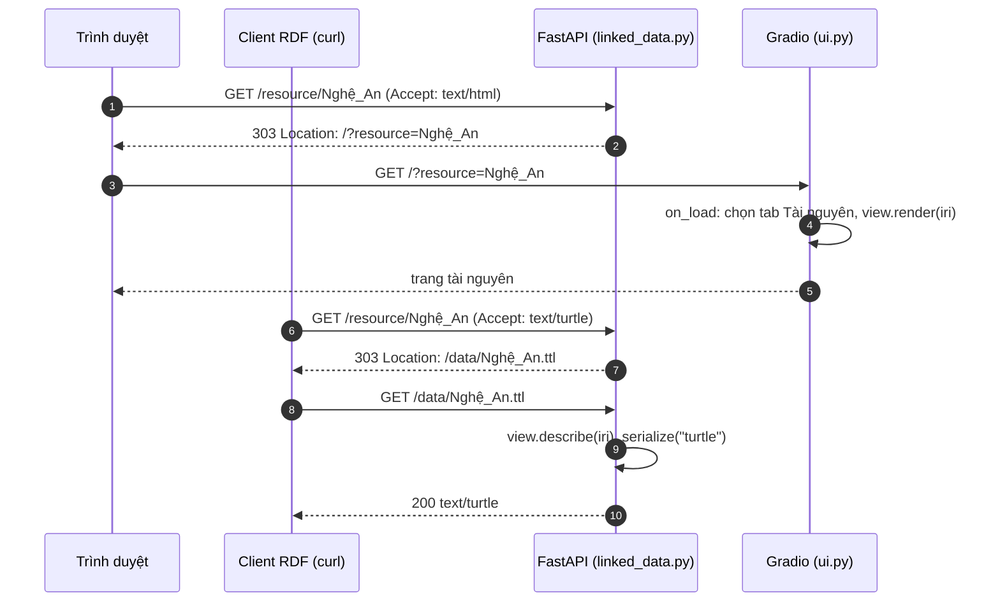

| Route | Kết quả |
|---|---|
| `GET /resource/{tên}` | 303 tới `/?resource={tên}`. Nếu `Accept` là `text/turtle`, `application/n-triples`, `application/ld+json` hoặc `application/rdf+xml` thì 303 tới `/data/{tên}.ttl` / `.nt` / `.jsonld` / `.rdf`. Có header `Vary: Accept`. |
| `GET /page/{tên}` | 303 tới `/?resource={tên}` (giống `dbpedia.org/page/…`) |
| `GET /data/{tên}.{đuôi}` | `describe`: mọi triple có tài nguyên là chủ ngữ, cùng tối đa 2.000 triple có nó là tân ngữ; có `Access-Control-Allow-Origin: *` |
| `GET /ontology/{thuật ngữ}` | định nghĩa của lớp hoặc thuộc tính `vio:` (Turtle): `describe_term` đi theo blank node nên restriction, danh sách của `owl:propertyChainAxiom` và `owl:members` được giữ nguyên; thêm lớp con, thuộc tính con và nghịch đảo trực tiếp |
| `GET /ontology.ttl` | toàn bộ `ontology/vi-ontology.ttl` |
| tên không có trong dataset | 404 |

`resolve()` nhận local name đã giải mã, có hoặc không có `_`, hoặc IRI đầy đủ. Hàm thử cả dạng đã mã hoá các ký tự
không an toàn, để khớp đúng IRI trong dữ liệu.

### 6.3 Các tab giao diện

| Tab | Module | Hoạt động |
|---|---|---|
| **Cây tài nguyên** (mặc định) | `web/resource_tree.ResourceTree` | Lớp `dbo:` → cây lớp `vio:` → tên thực thể, không kèm thuộc tính (6.5). Ô lọc theo tên, không phân biệt dấu. |
| **Tài nguyên** | `web/resource_page.ResourceView` | Trang kiểu `dbpedia.org/page/…` (6.4). Tìm kiếm: gõ rồi Enter thì mở kết quả tốt nhất, danh sách kết quả cập nhật khi gõ. Nút "Mở truy vấn trong tab SPARQL" điền `SELECT ?p ?o WHERE { <iri> ?p ?o }` rồi chuyển tab. |
| **Hỏi đáp** | `web/kg_rag.SparqlBasedKGRAG` | LLM sinh SPARQL, có SPARQL mode (6.6) |
| **SPARQL** | `web/sparql.SparqlService` | Soạn truy vấn với 19 prefix khai báo sẵn và 9 truy vấn mẫu (`web/examples.py`); kết quả dạng bảng, JSON hoặc CSV theo chuẩn SPARQL Results (serializer của rdflib) |

Giao diện luôn ở chế độ sáng: đoạn JS lúc tải trang gỡ class `dark` mà Gradio thêm vào `<body>` khi hệ điều hành
đang ở dark mode, nên không cần đổi URL.

### 6.4 Trang tài nguyên (`web/resource_page.py`)

| Phần | Cách dựng |
|---|---|
| Đầu trang | nhãn @vi, lớp `vio:` khai báo, IRI; nút tới Wikipedia (`foaf:isPrimaryTopicOf`), DBpedia và Wikidata (`owl:sameAs`), OpenStreetMap (toạ độ) |
| Tóm tắt | `dbo:abstract` @vi (thiếu thì dùng `rdfs:comment`) và `dbo:thumbnail` |
| Cây phân lớp | các lớp `vio:`/`dbo:` của thực thể. Mỗi lớp chọn một cha chính (ưu tiên cha `vio:`) để thành cây; các cha còn lại ghi "⊑ …". Nhãn "khai báo" hoặc "suy luận" xác định bằng cách tra triple `rdf:type` trong tập suy luận. |
| Liên kết dữ liệu mở | `owl:sameAs`, nguồn Wikipedia, `prov:wasDerivedFrom` (bản sửa đổi), toạ độ; link tải RDF bốn định dạng; lệnh `curl` mẫu |
| Đồ thị lân cận (SVG) | Chi tiết ngay dưới bảng này. |
| Cây quan hệ | `<details>` lồng nhau, chỉ đi theo triple khai báo trong `TREE_OUT`, tối đa `MAX_DEPTH = 3` bước. Chặng thi đấu được gộp vào nút đội, kèm năm, số trận, bàn thắng, cho mượn. Ở gốc có thêm chiều ngược (`TREE_IN`, gồm cả `playedFor` suy luận). Có giới hạn `TREE_BUDGET = 300` nút để trang của tỉnh lớn vẫn nhẹ. |
| Thuộc tính | bảng thuộc tính → giá trị như DBpedia, sắp `rdf:type`, nhãn, abstract → `vio:` → `dbo:` → khác → `vip:`; literal ghi kèm `@lang` hoặc kiểu dữ liệu; tối đa 40 giá trị mỗi thuộc tính; gắn nhãn "suy luận" |
| Được tham chiếu bởi | các triple trỏ tới thực thể, nhóm theo thuộc tính ("là vio:birthProvince của …") |

Cách dựng đồ thị lân cận:

- **Chọn nút:** thuộc tính đối tượng trong `LINK_PROPS`, quan hệ đi ra đặt bên phải, đi vào đặt bên trái. Tối đa
  `GRAPH_SIDE = 14` nút mỗi bên.
- **Không để một quan hệ chiếm hết chỗ:** nút được chọn xoay vòng giữa các thuộc tính, và bên nào dư thì chuyển sang
  bên còn trống.
- **Kiểu nét:** cạnh suy luận vẽ nét đứt; liên kết LOD ra ngoài là nút viền đứt.
- **Màu nút:** theo lớp (cầu thủ, CLB, sân, tỉnh, đại học).
- **Điều hướng:** mỗi nút là một liên kết `/resource/…`.

Liên kết nội bộ trỏ tới `/resource/…`, nên mỗi lần bấm là tải lại trang theo URL riêng của tài nguyên đó, giống
DBpedia, và gửi link cho người khác được.

### 6.5 Cây tài nguyên (`web/resource_tree.py`)

- **Cấu trúc cây:** một lớp có thể có nhiều lớp cha nhưng cây chỉ vẽ được một, nên mọi lớp theo cùng một quy tắc:
  cạnh của cây chỉ nối các lớp `vio:`, lớp cha `dbo:` ghi sau dấu "⊑" kèm nhãn "DBpedia" (rê chuột thấy nhãn @vi, ví dụ
  "Động vật"). 4 gốc `vio:` là `Person`, `Organisation`, `Location`, `CareerStation`; gốc ghi cả chuỗi lớp cha theo
  `050-dbo-alignment.ttl` (`ResourceTree.dbo_up`): `vio:Person ⊑ dbo:Person ⊑ dbo:Animal`, `vio:Organisation ⊑
  dbo:Organisation ⊑ dbo:Agent`, `vio:Location ⊑ dbo:Place`, `vio:CareerStation ⊑ dbo:CareerStation ⊑ dbo:TimePeriod`.
  Lớp `dbo:` không thành nút: số thực thể của chúng trùng với gốc `vio:` bên dưới (659 / 410 / 363 / 3.382) và nhãn
  @vi cũng trùng ("Người › Người"), nên thêm nút chỉ lặp lại. Cây phân lớp của trang Thực thể vẫn hiện `dbo:` thành
  nút vì nó liệt kê mọi `rdf:type` của một thực thể.
- **Số đếm:** mỗi lớp ghi tổng số thành viên, gồm cả thành viên có lớp nhờ suy luận, kèm số khai báo nếu khác.
  Ví dụ `vio:FootballClub 215 (61 khai báo)`, phần còn lại là đội nước ngoài suy ra từ restriction ∀.
- **Thành viên trực tiếp:** là thành viên của lớp nhưng không thuộc lớp con nào (`members[c] − ∪ members[con]`), giống
  thư mục và tệp. Ví dụ cầu thủ từng khoác áo đội tuyển nằm ở `NationalTeamPlayer`, không lặp lại ở `FootballPlayer`.
- **Nhóm ngoài cây lớp:** thể loại Wikipedia (`skos:Concept`, 1.154), trang đổi hướng (1.274), và tài nguyên chỉ có
  nhãn (1.382, là đích của liên kết trong infobox nhưng chưa có lớp). Tổng cộng 8.624 tài nguyên.
- **Giới hạn hiển thị:** tối đa 300 tên mỗi nút; khi lọc là 100 tên mỗi nút và mọi nhánh có kết quả được mở sẵn.

### 6.6 Hỏi đáp KG-RAG (`web/kg_rag.py`)

Chuyển thể từ chat dựa trên Cypher của project knowledge-graph-with-rag. Ở đây LLM sinh **SPARQL** và truy vấn chạy
trực tiếp trên graph rdflib, nên không cần Neo4j.

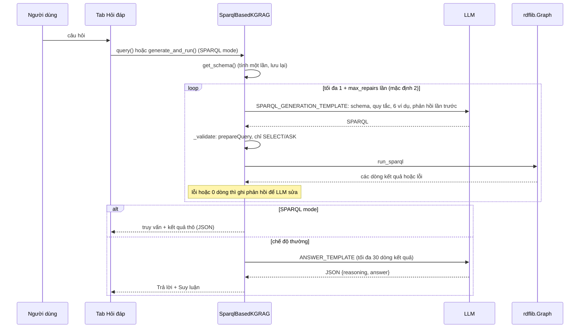

- **Schema đưa vào prompt:** chỉ gồm các lớp `vio:` chính và các lớp chặng thi đấu; với mỗi lớp là thuộc tính, số
  triple và một giá trị ví dụ. Thuộc tính `vip:` chỉ ghi số lượng, để prompt không quá dài.
- **Quy tắc trong prompt:**
  - Tìm thực thể theo `rdfs:label|skos:altLabel` bên trong một subquery.
  - Mẫu CareerStation; `playedFor`/`hasPlayer`.
  - Lọc tỉnh hiện hành bằng `FILTER NOT EXISTS { ?p a vio:FormerProvince }`.
  - Các lớp `dbo:` dùng được nhờ suy luận.
- **Mẹo hiệu năng:** rdflib áp `FILTER` sau khi đã nối toàn bộ BGP. Đặt bước tìm thực thể theo tên trong subquery
  `{ SELECT DISTINCT ?p WHERE { ?p a … ; rdfs:label|skos:altLabel ?n FILTER(…) } }` giảm từ khoảng 48 giây xuống
  khoảng 1 giây. Các truy vấn mẫu và các ví dụ trong prompt đều theo mẫu này.
- **Nhà cung cấp:** dùng `openai` SDK, nên chạy được với OpenAI, Gemini và Ollama qua `OPENAI_BASE_URL`. Với model
  `gpt-5*`/`o*` thì không gửi `temperature`.

### 6.7 SPARQL endpoint và truy vấn từ terminal (`web/endpoint.py`, `kg/query.py`)

`/sparql` làm theo SPARQL 1.1 Protocol, để chương trình khác (curl, SPARQLWrapper, YASGUI, `SPARQLStore` của rdflib)
truy vấn cùng graph với giao diện. Lệnh `python -m vidbpedia query` chạy truy vấn từ terminal, trên dataset nạp
trực tiếp hoặc gửi tới một endpoint (`--endpoint`). Cả hai dùng chung `kg/query.py`: `prepare` (parse, 19 prefix
khai báo sẵn), `run` và `serialize`.

| Yêu cầu | Truy vấn nằm ở |
|---|---|
| `GET /sparql?query=…` | tham số URL |
| `POST /sparql`, `application/x-www-form-urlencoded` | trường `query` của form |
| `POST /sparql`, `application/sparql-query` | thân request |

| Loại truy vấn | Định dạng kết quả (đầu tiên là mặc định) |
|---|---|
| SELECT, ASK | JSON `application/sparql-results+json`, XML `application/sparql-results+xml`, CSV `text/csv` (chỉ SELECT) |
| CONSTRUCT, DESCRIBE | Turtle, N-Triples, JSON-LD, RDF/XML |

Định dạng chọn theo tham số `format=` (tên hoặc MIME, như DBpedia), nếu không có thì theo `Accept` có trọng số `q`.
Định dạng không hợp với loại truy vấn thì dùng mặc định. Response có `Access-Control-Allow-Origin: *`.

- **Chỉ đọc:** parser của rdflib không nhận `INSERT`/`DELETE`, trả 400 kèm thông báo lỗi.
- **Không gửi request ra ngoài:** `/sparql` chặn `FROM`/`FROM NAMED` và `SERVICE` (400), vì hai mệnh đề này khiến
  rdflib tải dữ liệu từ URL khác. Lệnh `query` chạy trên máy thì không chặn.
- **Không treo giao diện:** truy vấn chạy trong threadpool. Chưa có giới hạn thời gian, vì rdflib không huỷ được một
  truy vấn đang chạy.
- **Hai chỗ không dùng serializer của rdflib 7.6:** XML kết quả tự sinh (`results_xml`) vì serializer XML ghi literal
  `0` và `false` thành rỗng; bảng trên terminal tự in vì serializer `txt` sắp xếp lại các dòng, làm mất `ORDER BY`.

```bash
curl -H "Accept: text/csv" --data-urlencode \
     "query=SELECT ?s ?cap WHERE { ?s a vio:Stadium ; vio:capacity ?cap } ORDER BY DESC(?cap) LIMIT 3" \
     http://127.0.0.1:7860/sparql
python -m vidbpedia query "ASK { vres:Nguyễn_Công_Phượng owl:sameAs dbr:Nguyễn_Công_Phượng }"
python -m vidbpedia query -f truy_van.rq --format csv
python -m vidbpedia query --endpoint http://127.0.0.1:7860/sparql "SELECT …"
```

---

## 7. Kiểm thử

`pytest` có 62 test, chạy trong khoảng 25 giây. Fixture `graph` trong `tests/conftest.py` nạp dataset một lần cho cả
phiên. Các test dùng cận dưới thay cho số cứng, để không gãy khi crawl lại.

| File | Số test | Nội dung |
|---|---|---|
| `test_sparql.py` | 12 | Competency questions có đáp án, ví dụ: lớp `dbo:` nhờ suy luận; quá trình thi đấu của Công Phượng; chain và inverse; CLB → sân → tỉnh; tỉnh nhiều cầu thủ nhất; 34 tỉnh hiện hành, Hà Tây → Hà Nội; redirect; `owl:sameAs` Unicode. Cũng chạy mọi truy vấn mẫu và ví dụ trong prompt. |
| `test_quality.py` | 5 | validation ra 0 lỗi; lint ontology theo quy ước bài giảng (bắt được lớp viết thường, thiếu nhãn, thiếu `rdfs:isDefinedBy`, thuộc tính cha chưa khai báo kiểu); phần suy luận không có `owl:sameAs`; số liệu trong stats nhất quán |
| `test_reasoning.py` | 4 | chain, inverse, restriction, báo vi phạm disjoint trên graph nhỏ; tiên đề `NationalTeamPlayer` ở dạng giao |
| `test_infobox.py` | 6 | template lồng, số kiểu Việt, ngày thành lập, cho mượn, danh sách, ngoặc rỗng, quy tắc IRI |
| `test_kg_rag.py` | 5 | luồng hỏi đáp với LLM giả lập: tự sửa, SPARQL mode, tách `answer`/`reasoning`, chặn CONSTRUCT/DELETE |
| `test_resource_page.py` | 14 | tìm kiếm bỏ dấu, trang tài nguyên, cây phân lớp, content negotiation, 303, 4 định dạng RDF đọc lại được, `/ontology` |
| `test_resource_tree.py` | 5 | cây lớp, lớp cha `dbo:` ghi sau "⊑" (gốc có cả chuỗi `dbo:Person ⊑ dbo:Animal`, không có nút trùng tên), thành viên trực tiếp, chỉ có tên (không có thuộc tính), ô lọc |
| `test_endpoint.py` | 11 | `/sparql` qua GET, POST form và POST trực tiếp; chọn định dạng theo `Accept`/`format`; XML đọc lại đúng `0`/`false`; ASK, CONSTRUCT; chặn cú pháp sai, `INSERT`, `FROM`, `SERVICE`; lệnh `query` trên dataset và qua endpoint (giữ `ORDER BY`) |

---

## 8. Các quyết định thiết kế

| Quyết định | Lý do | Phương án đã cân nhắc |
|---|---|---|
| Chọn thực thể qua Wikidata (`P31`, `P27`/`P17 = Q881`) | Thể loại viwiki do người dùng gán, thiếu nhất quán. Pipeline cũ crawl theo alphabet ra phần lớn tên tiểu hành tinh. | Duyệt cây thể loại; crawl toàn bộ |
| Domain bóng đá + tỉnh + đại học | Các thực thể trỏ lẫn nhau (cầu thủ → đội → sân → tỉnh), 78% có bài enwiki, hơn 95% có infobox | Domain người nổi tiếng (bản cũ có 378 người nước ngoài, không nối được với gì) |
| Ontology riêng `vio:` ⊑ `dbo:`, rồi suy luận ra `dbo:` | Có thuộc tính DBpedia chưa có (CareerStation chi tiết, FormerProvince); vẫn truy vấn được bằng từ vựng DBpedia | Dùng thẳng `dbo:` |
| Nối `vio:` với `dbo:` bằng `rdfs:subClassOf`, không dùng `owl:equivalentClass` | Domain, functional và disjoint của `vio:` chỉ áp lên dữ liệu của dự án; dùng tương đương thì mọi `dbo:Person` khi gộp graph cũng bị ràng buộc (anti-pattern Exclusivity, slide 07). Giống cách DBpedia nối vào DOLCE | `vio:Person owl:equivalentClass dbo:Person` |
| Cây lớp chỉ vẽ cạnh giữa lớp `vio:`; lớp cha `dbo:` ghi sau "⊑" | Cây chỉ vẽ được một cha (đa kế thừa, slide 03) nên cần một quy tắc cho mọi lớp; ánh xạ sang từ vựng ngoài là thông tin của từng lớp (quy tắc LOD 5, slide 04); cây lớp của DBpedia cũng không lấy lớp DOLCE làm gốc. Nút `dbo:` chỉ lặp số và nhãn của gốc `vio:` | Treo 4 gốc dưới chuỗi lớp `dbo:` |
| Chỉ tạo lớp `vio:` khi có tiên đề hoặc câu hỏi cần; lớp phía trên dùng lại `dbo:` kèm nhãn @vi | Không có `vio:Animal`, `vio:Agent`, `vio:Place`, `vio:TimePeriod`: không câu hỏi hay tiên đề nào cần, thêm vào chỉ tạo IRI thứ hai cho cùng khái niệm. "Động vật" là nhãn của `dbo:Animal` (URI khác nhãn, slide 03; AAA) | Tạo lớp `vio:` cho mọi lớp `dbo:` trên chuỗi |
| IRI giữ Unicode | Giống các chapter DBpedia và `dbr:` hiện tại, dễ đọc | Mã hoá phần trăm toàn bộ |
| Suy luận trên "phần khung", bỏ sameAs/functional/cardinality | Nhanh hơn; tránh OWL RL gộp thực thể | Suy luận trên cả graph |
| Tách khai báo / suy luận thành file riêng | Biết triple nào do reasoner sinh ra; hiển thị được nhãn "suy luận" trên giao diện | Chỉ xuất bản gộp |
| Không khai báo `tenant owl:inverseOf ground` | Hai thuộc tính khác nghĩa: đội từng thuê sân khác với sân nhà | Giữ inverse (gây kết quả sai, mục 5.2) |
| Lớp `FormerProvince` thay vì xoá tỉnh cũ | Giữ được lịch sử (`successor`/`predecessor`) mà vẫn trả đúng "34 tỉnh" | Chỉ lấy tỉnh hiện hành |
| rdflib trong bộ nhớ | Đủ cho khoảng 130 nghìn triple, triển khai bằng Python thuần | Virtuoso (vẫn có trong `docker-compose.yml`, tuỳ chọn) |
| 303 tới `/?resource=…` thay vì trang HTML riêng | Dùng lại đúng giao diện của tab Tài nguyên; URL gửi cho người khác được | Trang HTML tĩnh do FastAPI sinh |
| Cache SQLite + commit dữ liệu thô | Dựng lại được mà không cần mạng, kết quả ổn định giữa các lần chạy | Crawl lại mỗi lần |

---

## 9. Thêm một lớp thực thể mới

Ví dụ thêm lớp huấn luyện viên. Các chỗ cần sửa, theo thứ tự pipeline:

1. **Thu thập:** `crawl/wikidata_seeds.py`
   - Thêm `(Lớp, mẫu Wikidata)` vào `SEEDS`, đúng vị trí ưu tiên.
   - Thêm thuộc tính cần lấy vào `TIME_PROPS` / `QUANTITY_PROPS` / `ITEM_PROPS`.
2. **Ontology:**
   - Thêm lớp, thuộc tính, nhãn vi/en và `rdfs:isDefinedBy vio:` vào một module trong `ontology/`, kèm `rdfs:subClassOf` một lớp `dbo:`. Lớp `dbo:` mới dùng tới thì khai báo ở `050-dbo-alignment.ttl` (kiểu, nhãn, `rdfs:isDefinedBy dbo:`). Nếu cần, thêm lớp đó vào một tiên đề disjoint. `check_tbox` báo lỗi nếu thiếu.
   - Chạy `python -m vidbpedia ontology`.
3. **Ánh xạ infobox:** `crawl/infobox_mappings.py`
   - Thêm họ template vào `MAPPINGS` và `CLASS_FAMILY`.
   - Nếu cần, thêm thuộc tính vào `PRECEDENCE`.
4. **Dựng RDF:** `crawl/build_rdf.py`
   - Thêm lớp vào `GROUP` (tên file đầu ra).
   - Viết `build_<Lớp>(self, g, e, s, facts, ib, page)`; `Builder.build` gọi hàm này theo tên lớp.
5. **Kiểm tra:** thêm lớp vào `kg/validation.MAIN_CLASSES`. Nếu có giá trị cần kiểm tra khoảng hợp lý, bổ sung vào `check_plausibility`.
6. **Giao diện và hỏi đáp:**
   - `web/resource_page.py`: thêm vào `MAIN_CLASSES`, `CLASS_NAMES`, `NODE_KIND` (màu nút), `LINK_PROPS` / `TREE_OUT`.
   - `web/kg_rag.SCHEMA_CLASSES`: thêm lớp, và nếu được thì thêm một ví dụ few-shot.
7. **Test:** viết competency question mới trong `tests/test_sparql.py`.
8. **Chạy lại:** `python -m vidbpedia seeds`, `enrich`, `build`, `postprocess --strict`, rồi `pytest`.
